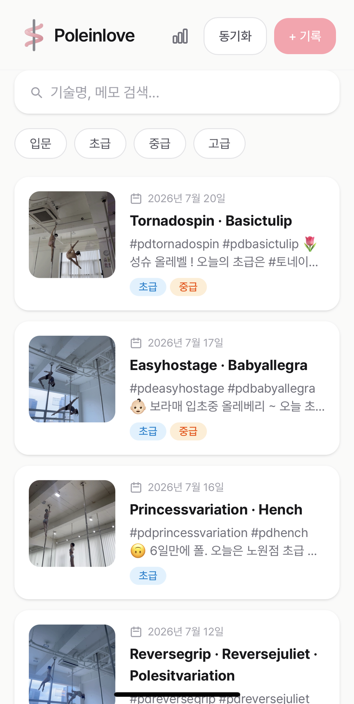
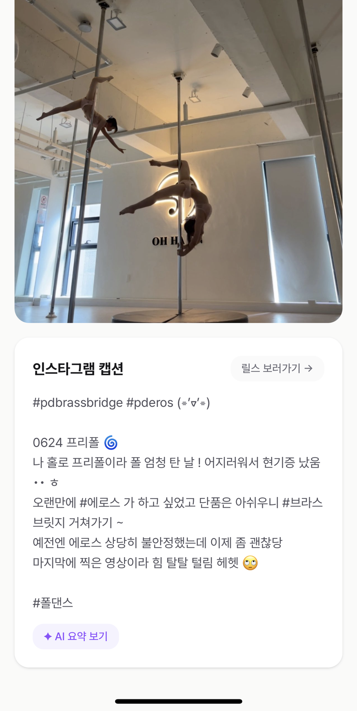
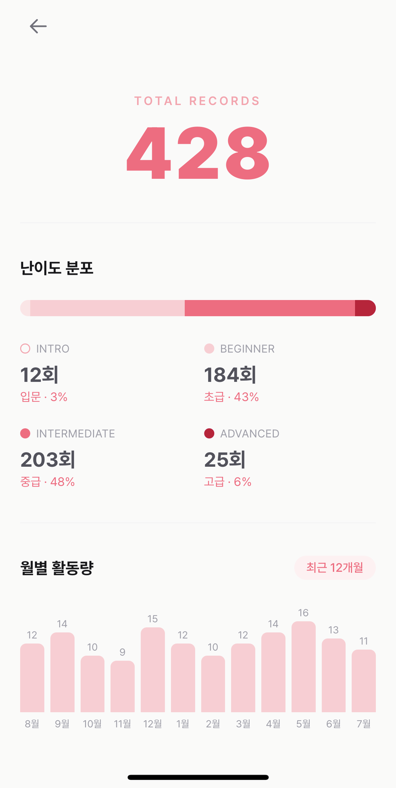
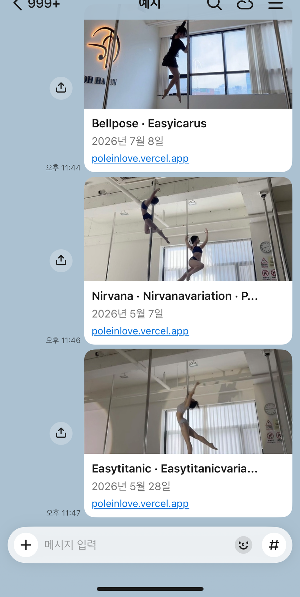

# 🧜🏻‍♀️ poleinlove

인스타그램에 업로드 된 폴댄스 연습 기록을 **기술명**과 **난이도**로 쉽게 찾을 수 있도록 돕는 개인 운동 아카이브 서비스.

"그 기술 예전에 연습할 때 뭐가 어려웠더라?"를 다시 찾기 위해 스크롤을 내려 게시글을 일일이 찾아야 하는 비효율성에서 출발했다. 인스타그램 캡션에 `#pd기술명` 형태로 남기던 방식을 활용해서, 게시물을 올리기만 하면 기술명·난이도가 자동으로 정리되고 검색 가능한 기록으로 쌓이도록 만들었다.

<table>
  <tr>
    <td></td>
    <td></td>
    <td></td>
    <td></td>
  </tr>
  <tr>
    <td align="center">기록 목록</td>
    <td align="center">기록 상세</td>
    <td align="center">통계</td>
    <td align="center">공유 링크 미리보기</td>
  </tr>
</table>

## ✨ 뭘 할 수 있나

**기록 관리**

- 날짜·기술명·난이도 태그·사진·회고(어려웠던 점/좋았던 점/아쉬웠던 점)로 기록 작성·수정
- 기술명 검색 + 태그 필터로 과거 기록 탐색
- 기록별 공개 공유 페이지 (카카오톡 등에 링크 붙여넣으면 썸네일·제목 미리보기 노출)

**인스타그램 연동**

- OAuth로 계정 연동 후, 캡션의 `#pd기술명` 해시태그를 파싱해 기술명 자동 추출
- Vercel Cron으로 매일 밤 새 릴스를 자동으로 가져와 기록 생성 (수동 동기화 버튼도 별도 제공)
- 장기 액세스 토큰(60일 만료) 만료 임박 시 자동 갱신 — 사람이 개입하지 않아도 연동이 끊기지 않도록 처리

**AI 어시스트**

- Claude API로 캡션에서 난이도 태그 추천, 캡션 내용 요약
- 여러 기록을 배치로 묶어 한 번에 처리해 API 호출을 절약

**통계**

- 난이도 분포와 최근 1년 월별 활동량 시각화

**계정/보안**

- 회원가입 없는 단일 비밀번호 게이트. 세션은 별도 라이브러리 없이 `crypto.createHmac`으로 서명한 쿠키로 검증

## 🛠️ Tech Stack

- **Frontend**: Next.js 16 (App Router), React 19, TypeScript, Tailwind CSS 4
- **Backend**: Next.js Route Handlers, Server Actions
- **Database**: PostgreSQL + Prisma
- **Storage**: Supabase Storage (브라우저에서 직접 업로드)
- **AI**: Claude API (Anthropic SDK)
- **Infra**: Vercel (배포 + Cron Job)

## 📄 문서

- [`docs/requirements.md`](docs/requirements.md) — 문제 정의, 타겟, 초기 스코프
- [`docs/decisions.md`](docs/decisions.md) — 기술/설계 선택과 그 이유
- [`docs/troubleshooting.md`](docs/troubleshooting.md) — 겪은 문제와 해결 과정
